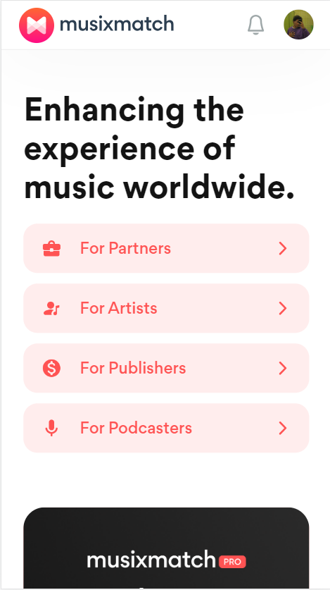
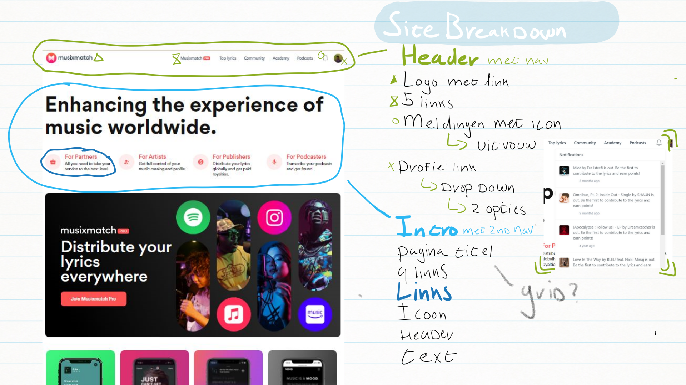
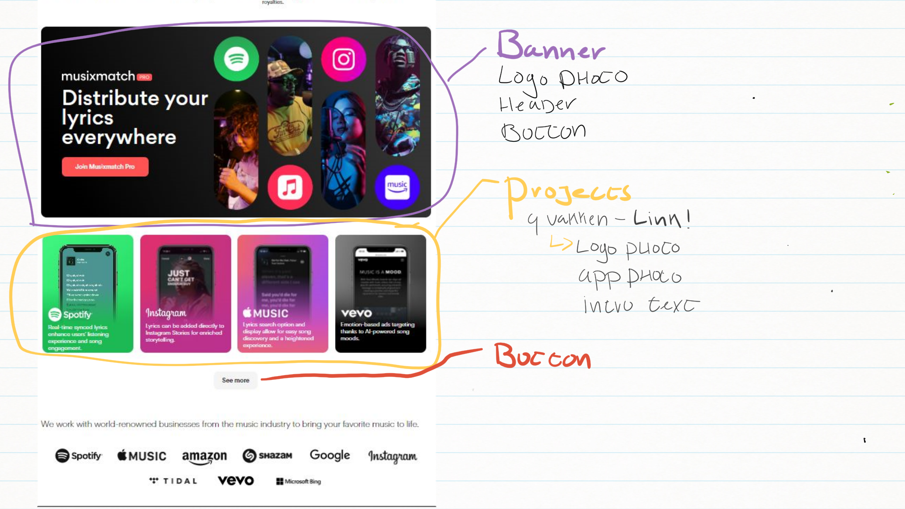
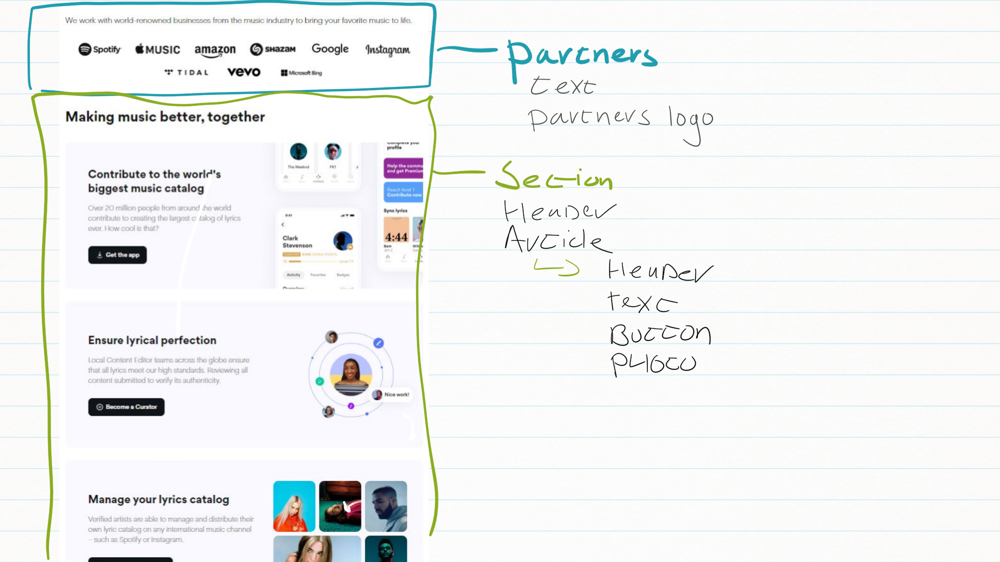
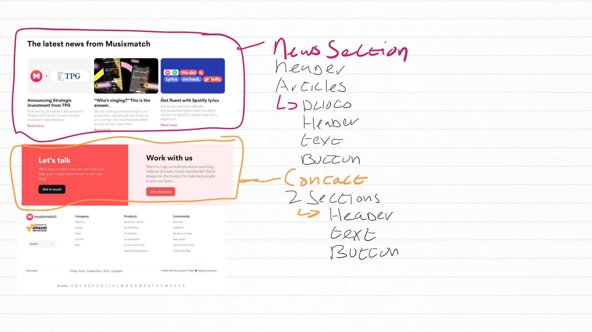

# Procesverslag
Markdown is een simpele manier om HTML te schrijven.  
Markdown cheat cheet: [Hulp bij het schrijven van Markdown](https://github.com/adam-p/markdown-here/wiki/Markdown-Cheatsheet).

Nb. De standaardstructuur en de spartaanse opmaak van de README.md zijn helemaal prima. Het gaat om de inhoud van je procesverslag. Besteedt de tijd voor pracht en praal aan je website.

Nb. Door *open* toe te voegen aan een *details* element kun je deze standaard open zetten. Fijn om dat steeds voor de relevante stuk(ken) te doen.

## Jij

  
uitwerken voor kick-off werkgroep

  ### Auteur:
  Lua Telgt

  #### Je startniveau:
  Blauw Rood

  #### Je focus:
  Surface Plane
 

## Je website

  
uitwerken voor kick-off werkgroep

  ### Je opdracht:
  https://www.musixmatch.com/

  #### Screenshot(s) van de eerste pagina (small screen): 
  Homepage Musicmatch
  

  #### Screenshot(s) van de tweede pagina (small screen):
  Musixmatch Pro pagina  
  
 

   
## Toegankelijkheidstest 1/2 (week 1)

  
uitwerken na test in 2e werkgroep

  ### Bevindingen
  Lijst met je bevindingen die in de test naar voren kwamen:
  <ul>
    <li>De website is een frame in een frame. Hierdoor is hij met een screenreader lastig te navigeren omdat de kans groot is dat je de hele content skipt en beweegt tussen de header (die trouwens ook geen navigatie heeft) of de footer.</li>
    <li>Veel elementen zitten niet in tags zoals tekst die niet in Headers of P's zitten.</li>
    <li>Door weinig kleurcontrast zijn sommige knoppen niet toegankelijk</li>
    <li>Navigeren in de website is een hel en op veel plekken kom je niet door de homepage en zijn alleen te bereiken via Laptop of google. Zoals lyrics pagina's</li>
    <li>Foto's hebben geen ALT tekst en zitten vaak uberhaupt niet in een IMG tag</li>
  </ul>

## Breakdownschets (week 1)

  
uitwerken na afloop 3e werkgroep

  ### de hele pagina: 
  
  
  
  

## Voortgang 1 (week 2)

  
uitwerken voor 1e voortgang

  ### Stand van zaken
  hier dit ging goed & dit was lastig (neem ook screenshots op van delen van je website en code)

  Het was best lastig om terug te komen in HTML en CSS aangezien ik dit al lang niet gedaan had maar ik had al snel de draad weer opgepakt. Het was leuk om weer aan de slag te gaan en ik zag al snel dingen vormen mijn code is nog niet perfect omdat ik vooral een beetje aan het opwarmen was. Hier en daaar heb ik wel al een paar dingen aangepast maar ik ben van plan zeker nog wel meer te doen omdat ik voor dezelfde soort element ook soms hele andere code gebruk later omdat deze eigenlijk wel echt een stukje beter is. Ik wil dus ook graag deze technieken bij oudere elementen gaan gebruiken.

  ### Agenda voor meeting
  samen met je groepje opstellen

  | student 1      | student 2          | student 3    | student 4        |
  | ---            | ---                | ---          | ---              |
  | dit bespreken  | en dit             | en ik dit    | en dan ik dat    |
  | en dat ook nog | dit als er tijd is | nog een punt | dit wil ik zeker |
  | ...            | ...                | ...          | ...              |

  ### Verslag van meeting
  hier na afloop snel de uitkomsten van de meeting vastleggen

  - Let op het verslag!
  - Misschien dat ik ook de navigatie van de site kan verbeteren. 
  - Knoppen aanpassen voor contrast

## Voortgang 2 (week 3)

  
uitwerken voor 2e voortgang

  ### Stand van zaken
 Ik merkte al snel dat grote deel van de CSS een stuk beter kon omdat ik al snel weer trucjes en manier herinnerden. Ik ga dus het eerste deel van CSS als niet de hele CSS opnieuw doen om ervoor te zorgen dat ik alle CSS zo netjes en simpel mogelijk heb. Zo gaat niet alleen de kwaliteit van mijn website maar ook van mijn code er op vooruit.

 #### 18/09
 Ik ben begonnen aan de 2e pagina. Voor deze pagina heb ik de volledige pagina opgedeeld in een grid voor de margins aan dezijkanten. Hierdoor kreeg ik wel een probleem toen ik een element had dat voledig spreide over de pagina.
  
  Wat ik kon doen is een grid in een grid maken. Ik ga dan de volledige sectie in de hoofdgrid volledig uitspreiden ipv alleen in column 2 en dan dezelfde grid in de sectie maken en daarin alles in column 2 zetten behalve het element dat spreide.

  Nog een probleem is de 2 overlappende foto's. Ik kon hiervoor nog een grid maken maar dan had ik een grid in een grid in een grid. Uiteindelijk heb ik besloten dat de foto op de achtergrond inderdaad gewoon een achtergrond was en heb ik deze erin gezet d.m.v. een css background image.
    
 

  ### Agenda voor meeting
  samen met je groepje opstellen

  | student 1      | student 2          | student 3    | student 4        |
  | ---            | ---                | ---          | ---              |
  | dit bespreken  | en dit             | en ik dit    | en dan ik dat    |
  | en dat ook nog | dit als er tijd is | nog een punt | dit wil ik zeker |
  | ...            | ...                | ...          | ...              |

  ### Verslag van meeting
  hier na afloop snel de uitkomsten van de meeting vastleggen

  - punt 1
  - punt 2
  - nog een punt
- ...

## Toegankelijkheidstest 2/2 (week 4)

  
uitwerken na test in 9e werkgroep

  ### Bevindingen
  Lijst met je bevindingen die in de test naar voren kwamen (geef ook aan wat er verbeterd is):

## Voortgang 3 (week 4)

  
uitwerken voor 3e voortgang

  ### Stand van zaken
  hier dit ging goed & dit was lastig (neem ook screenshots op van delen van je website en code)

  ### Agenda voor meeting
  samen met je groepje opstellen

  | student 1      | student 2          | student 3    | student 4        |
  | ---            | ---                | ---          | ---              |
  | dit bespreken  | en dit             | en ik dit    | en dan ik dat    |
  | en dat ook nog | dit als er tijd is | nog een punt | dit wil ik zeker |
  | ...            | ...                | ...          | ...              |

  ### Verslag van meeting
  hier na afloop snel de uitkomsten van de meeting vastleggen

  - punt 1
  - punt 2
  - nog een punt
  - ...

## Eindgesprek (week 5)

  
uitwerken voor eindgesprek

  ### Je uitkomst - karakteristiek screenshots:
  

  ### Dit ging goed/Heb ik geleerd: 
  Korte omschrijving met plaatjes

  

  ### Dit was lastig/Is niet gelukt:
  Korte omschrijving met plaatjes

  

## Bronnenlijst

  
continu bijhouden terwijl je werkt

  Nb. Wees specifiek ('css-tricks' als bron is bijv. niet specifiek genoeg). 
  Nb. ChatGpT en andere AI horen er ook bij.
  Nb. Vermeld de bronnen ook in je code.

  1. bron 1
  2. bron 2
  3. ...

