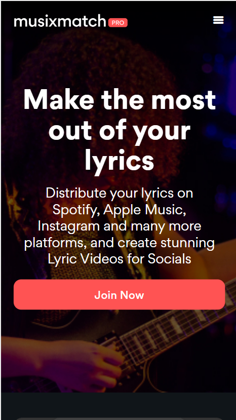
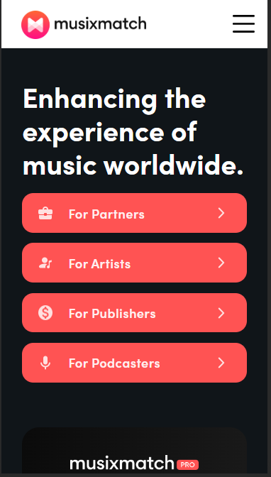

 # Procesverslag
Markdown is een simpele manier om HTML te schrijven.  
Markdown cheat cheet: [Hulp bij het schrijven van Markdown](https://github.com/adam-p/markdown-here/wiki/Markdown-Cheatsheet).

Nb. De standaardstructuur en de spartaanse opmaak van de README.md zijn helemaal prima. Het gaat om de inhoud van je procesverslag. Besteedt de tijd voor pracht en praal aan je website.

Nb. Door *open* toe te voegen aan een *details* element kun je deze standaard open zetten. Fijn om dat steeds voor de relevante stuk(ken) te doen.

## Jij

  
uitwerken voor kick-off werkgroep

  ### Auteur:
  Lua Telgt

  #### Je startniveau:
  Blauw Rood

  #### Je focus:
  Surface Plane
 

## Je website

  
uitwerken voor kick-off werkgroep

  ### Je opdracht:
  https://www.musixmatch.com/

  #### Screenshot(s) van de eerste pagina (small screen): 
  Homepage Musicmatch
   
  

  #### Screenshot(s) van de tweede pagina (small screen):
  Musixmatch Pro pagina 
   
  
 

   
## Toegankelijkheidstest 1/2 (week 1)

  
uitwerken na test in 2e werkgroep

  ### Bevindingen
  Lijst met je bevindingen die in de test naar voren kwamen:
  <ul>
    <li>De website is een frame in een frame. Hierdoor is hij met een screenreader lastig te navigeren omdat de kans groot is dat je de hele content skipt en beweegt tussen de header (die trouwens ook geen navigatie heeft) of de footer.</li>
    <li>Veel elementen zitten niet in tags zoals tekst die niet in Headers of P's zitten.</li>
    <li>Door weinig kleurcontrast zijn sommige knoppen niet toegankelijk</li>
    <li>Navigeren in de website is een hel en op veel plekken kom je niet door de homepage en zijn alleen te bereiken via Laptop of google. Zoals lyrics pagina's</li>
    <li>Foto's hebben geen ALT tekst en zitten vaak uberhaupt niet in een IMG tag</li>
  </ul>
Volledige eerste test:

## Breakdownschets (week 1)

  
uitwerken na afloop 3e werkgroep

  ### de hele pagina: 
  
  
  
  

## Voortgang 1 (week 2)

  
uitwerken voor 1e voortgang

  ### Stand van zaken
  hier dit ging goed & dit was lastig (neem ook screenshots op van delen van je website en code)

  Het was best lastig om terug te komen in HTML en CSS aangezien ik dit al lang niet gedaan had maar ik had al snel de draad weer opgepakt. Het was leuk om weer aan de slag te gaan en ik zag al snel dingen vormen mijn code is nog niet perfect omdat ik vooral een beetje aan het opwarmen was. Hier en daaar heb ik wel al een paar dingen aangepast maar ik ben van plan zeker nog wel meer te doen omdat ik voor dezelfde soort element ook soms hele andere code gebruk later omdat deze eigenlijk wel echt een stukje beter is. Ik wil dus ook graag deze technieken bij oudere elementen gaan gebruiken.

  ### Verslag van meeting
  hier na afloop snel de uitkomsten van de meeting vastleggen

  - Let op het verslag!
  - Misschien dat ik ook de navigatie van de site kan verbeteren. 
  - Knoppen aanpassen voor contrast

## Voortgang 2 (week 3)

  
uitwerken voor 2e voortgang

  ### Stand van zaken
 Ik merkte al snel dat grote deel van de CSS een stuk beter kon omdat ik al snel weer trucjes en manier herinnerden. Ik ga dus het eerste deel van CSS als niet de hele CSS opnieuw doen om ervoor te zorgen dat ik alle CSS zo netjes en simpel mogelijk heb. Zo gaat niet alleen de kwaliteit van mijn website maar ook van mijn code er op vooruit.

 ### 18/09
 Ik ben begonnen aan de 2e pagina. Voor deze pagina heb ik de volledige pagina opgedeeld in een grid voor de margins aan dezijkanten. Hierdoor kreeg ik wel een probleem toen ik een element had dat voledig spreide over de pagina.
  

 
  Wat ik kon doen is een grid in een grid maken. Ik ga dan de volledige sectie in de hoofdgrid volledig uitspreiden ipv alleen in column 2 en dan dezelfde grid in de sectie maken en daarin alles in column 2 zetten behalve het element dat spreide.

  Nog een probleem is de 2 overlappende foto's. Ik kon hiervoor nog een grid maken maar dan had ik een grid in een grid in een grid. Uiteindelijk heb ik besloten dat de foto op de achtergrond inderdaad gewoon een achtergrond was en heb ik deze erin gezet d.m.v. een css background image.
    
    

 ### 21/09
 Ik heb vandaag het carousel op de Pro Pagina gemaakt. Ik heb hiervoor javascript gebruikt Het was even uitvogelen nadat ik het lang niet heb gebruikt maar het is mij uiteindelijk gelukt met de volgende code:
 

 
Ik heb hier alle carousel elementen op hidden gezet behalve degene die getoond werd. Ik heb daarna met de knoppen er voor gezogt dat er een Var word aangepast die bepaald om welke item we nu zitten. Dit item werd dan op hidden gezet en het volgende element werd van hidden afgehaald
#### Opmerking
Op een gegeven moment stopte de code met werken. Ik heb de carousel nu gemaakt met een opacity in plaats van display none property. De code ziet er nu als volgt uit:
  

  ### Verslag van meeting
  #### Voorbereiding:
  Ik ging de meeting in met de volgende vragen:
  Moet ik iets doen aan de navigatie?
  Kan ik headers op hidden zetten?
  Hoe maak ik een darkmode?
  
  #### Uitkomsten:
  hier na afloop snel de uitkomsten van de meeting vastleggen
  - Na overleg heb ik besloten toch een navigatie aan te maken.
  - In plaats op hidden zet ik headers die niet gezien hoeven te worden maar wel op gepakt moeten worden door de screenreader op Visibility Hidden
  - Elaine heeft me geholpen met het onderzoeken naar Dark Mode
  
  ### 24/09
  Ik ben na aanleiding van de feedback begonnen aan een hamburger menu om een navigatie op de mobiele pagina te zetten, iets wat de originele website niet had.
  Ik heb hiervoor als placeholder de elementen uit de desktop versie gepakt.
  Het menu zag er als volgt uit:
    

 
Ik heb de links in het menu ook states gegeven:
  

### 27/09
Ik ben begonnen aan de Dark Mode. Dit ging best wel snel. Maar doordat mijn css niet heel consistent was moest ik veel aanpassen in de CSS op de Darkmode code zo simpel mogelijk gehouden.
Het resultaat was als volgt:
  

 
Nog een probleem was de Pro pagina: Die zat namelijk standaard in darkmode. Deze heb ik dus eerst een light mode gegeven en daarna een nieuwe darkmode.
Ik heb namelijk ooit een keer een artikel gelezen over darkmode: Wit op zwart is een heftig contrast dat voor pijn aan de ogen kan zorgen. Ik heb daarom gekozen voor een iets roze wit (Naar de huisstijl) en een oets blauwerige zwart.
De light mode van de pro page zag er zo uit:
 

 

en zo zag de nieuwe darkmode eruit:
 

## Toegankelijkheidstest 2/2 (week 4)

  
uitwerken na test in 9e werkgroep

  ### Bevindingen
  Ik had nog een plek een sectie zonder header en mijn propage had geen ALT's nog

## Voortgang 3 (week 4)

  
uitwerken voor 3e voortgang

  ### Stand van zaken
  Tot nu toe gaat alles goed. Ik heb besloten om nog 2 extra modes. Dark mode en High Contrast mode.
  Deze heb ik besloten iets anders te maken. Ik wilde namelijk gaan werken met Local storage zodat deze instelling werd meegenomen over pagina's

  Chat gpt > Foto code > foto uitleg
  Ik heb eerst chat gpt gevraagd hoe dit moet. (Zie bronnen voor volledig gesprek). Zij had de code voor mij geschreven maar ik snapte deze niet dus ik had gevraagd om elk onderdeel nog even uit te leggen begreep ik het en heb ik de code zelf geschreven en aangepast.
   

 
   

 
  
  Dit werkte dus nu kon ik beide modi maken.
  Ik ben begonnen met onderzoek doen naar kleurcontrasten en heb op basis daarvan een hoogcontrast schema opgesteld. Het hoge contrast werd toegevoegd doormiddel van classes aan de body.
  Omdat het volledige achtergrond nu zwart is, Hadden meerdere elementen geen duidelijke visuele hirachie. Dit ging met namen om List elementen deze heb ik dus een extra omleining gegeven
     

 

Om de modi te activeren staan er nu nieuwe knoppen in het Hamburger menu
   

 

zo ziet de volledige large text en contrast modi eruit
   

 
   

 
  
## Eindgesprek (week 5)

  
uitwerken voor eindgesprek

  ### Dit ging goed/Heb ik geleerd: 
Ik heb tijdens dit project meer geleerd over toegankelijkheid en heb voor dit project ook meer onderzoek gedaan hierna, dit ging dus best wel goed. Ook heb ik geleerd hoe ik localstorage moet gebruiken en deze kon gebruiken voor style changes, die ook heb kunnen uitvoeren omdat ik heb geleerd over custom properties. Dit is ook de eerste keer dat ik een hamburger menu.

  ### Dit was lastig/Is niet gelukt:
Ik had graag mijn CSS opnieuw gedaan omdat ik het best een rommel vond alleen hier ben ik niet aan toe gekomen. Ik had graag ook nog naar responsiveness gekeken aangezien dit niet mijn sterkste kan is en ik dit graag verder had ontdekt. Ook ben ik tijdens dit project begonnen met de code voor mijn portefolio waar ik veel heb geleerd en gedaan. Dingen die ik ook hier had willen toepassen.

Ik heb ook niet alles kunnen doen, zo missen beide pagina's de laatste sectie en een footer.

## Bronnenlijst

  
continu bijhouden terwijl je werkt

  Nb. Wees specifiek ('css-tricks' als bron is bijv. niet specifiek genoeg). 
  Nb. ChatGpT en andere AI horen er ook bij.
  Nb. Vermeld de bronnen ook in je code.

  1. [bron 1](https://chat.openai.com/share/dada8ec5-f187-40ad-8f30-bdf88e9b9e40)https://chat.openai.com/share/dada8ec5-f187-40ad-8f30-bdf88e9b9e40
  2. Elaine

